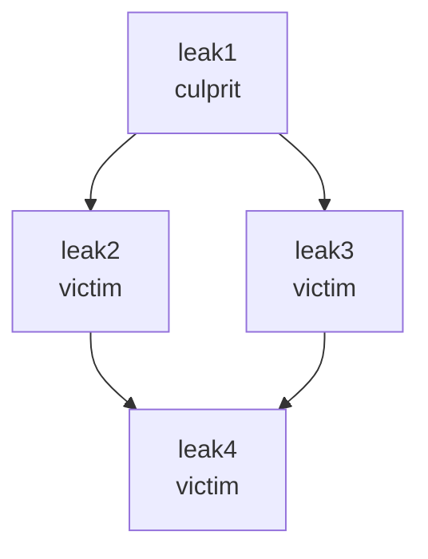

Coming soon! See https://github.com/flutter/devtools/issues/3951.

The text below is under construction.

[](https://github.com/dart-lang/leak_tracker/actions/workflows/ci.yaml)

# Memory Leak Tracker

This is a framework for memory leak tracking for Dart and Flutter applications.

## Quick start to track leaks for Flutter

### Flutter application

1. Before `runApp` invocation, enable leak tracking, and connect the Flutter memory allocation events:

```dart
import 'package:flutter/foundation.dart';
import 'package:leak_tracker/leak_tracker.dart';

...

enableLeakTracking();
MemoryAllocations.instance
      .addListener((ObjectEvent event) => dispatchObjectEvent(event.toMap()));
runApp(...

```

2. Run the application in debug mode and watch for a leak related warnings. If you see a warning, open the link to investigate the leaks.

TODO(polina-c): implement the link and add example of the warning.

### Flutter tests

Wrap your tests with `withLeakTracking` to setup automated leak verification:

```dart
test('...', () async {
  final leaks = await withLeakTracking(
    () async {
      ...
    },
    throwOnLeaks: false,
  );

  expect(leaks.total, 0);
});
```

## Leak tracking concepts

Before reading about leak tracking, understand [Dart memory concepts](https://docs.flutter.dev/development/tools/devtools/memory#basic-memory-concepts).

### Addressed leak types

The leak tracker can catch only certain types of leaks, in particular, related to timing of disposal and garbage collection.

The tool assumes that, with proper memory management,
an object's disposal and garbage collection should happen sequentially,
close to each other.

By monitoring disposal and GC events, the tool detects different types of leaks:

- **Not disposed, but GCed (not-disposed)**:
    - a disposable object was GCed,
       without being disposed first. This means that the object's disposable content
       is using memory after the object is no longer needed.
       To fix the leak, invoke `dispose()` to free up the memory.

- **Disposed, but not GCed (not-GCed)**:
    - an object was disposed,
       but not GCed after certain number of GC events. This means that
       a reference to the object is preventing it from being
       garbage collected after it's no longer needed.
       To fix the leak, after disposal assign all reachable references
       of the object to null:

    ```
    myField.dispose();
    myField = null;
    ```

- **Disposed and GCed late (GCed-late)**:
    - an object was disposed and then GCed,
       but GC happened later than expected. This means the retaining path was
       holding the object in memory for some period, but then disappeared.

- **Disposed, but not GCed, without path (not-GCed-without-path)**:
    - an object
       was disposed and not GCed when expected, but retaining path is not detected,
       that means that the object will be most likely GCed in the next GC cycle,
       and the leak will convert to **GCed-late** leak.

### Culprits and victims

If you have a set of not-GCed objects, some of them (victims)
might not be GC-ed because they are held by others (culprits).
Normally, to fix the leaks, you need to only fix the culprits.

**Victim**: a leaked object, for which the tool could find another
leaked object that, if fixed, would also fix the first leak.

**Culprit**: a leaked object that is not detected to be the victim
of another object.

The tool detects which leaked objects are culprits, so you know where to focus.

For example, out of four not-GCed leaks on the following diagram,
only one is the culprit, because, when the object is fixed
and GCed, the victims it referenced will be also GCed:



## Limitations

### By tracked classes

The leak tracker will catch leaks only for instrumented objects (See [concepts](#leak-tracking-concepts) for details).

However, the good news are:

1. Most of disposable Flutter Framework classes are already instrumented. So, Widget related
leaks in your Flutter application will be cought without additional effort.

2. If a leak involves at least one instrumented object, the leak will be caught and all
other objects, even non-instrumented, will stop leaking as well.

See [the instrumentation guidance](#instrument-your-code).

### By build mode

The leak tracker availability differs by build modes. See [Dart build modes](https://github.com/dart-lang/site-www/issues/4436) or [Flutter build modes](https://docs.flutter.dev/testing/build-modes).

**Dart development and Flutter debug**

Leak tracking is fully available.

**Flutter profile**

Leak tracking is available, but MemoryAllocations that listens to Flutter instrumented objects,
should be [turned on](https://github.com/flutter/flutter/blob/15af81782e19ebe7273872f8b07ac71df4e749f2/packages/flutter/lib/src/foundation/memory_allocations.dart#L13) if you want to track Flutter Framework objects.

**Dart productive and Flutter release**

Leak tracking is disabled.

NOTE: If you are interested in enabling leak tracking for release mode, please, comment [here](https://github.com/dart-lang/leak_tracker/issues/25).

## Instrument your code

If you want to catch leaks for objects outside of Flutter Framework,
(that are already instrumented) you need to instrument them.

For each tracked object the library should get two signals from your code:
(1) the object is created and (2) the object is not in use. It is most convenient to give first signal in constractor and the second one in the method `dispose`:

```dart
import 'package:leak_tracker/src/leak_tracker.dart';

class InstrumentedClass {
  InstrumentedClass() {
    dispatchObjectCreated(
      library: library,
      className: '$InstrumentedClass',
      object: this,
    );
  }

  static const library = 'package:my_package/lib/src/my_lib.dart';

  void dispose() {
    dispatchObjectDisposed(object: this);
  }
}
```

## Start/stop leak tracking

To start leak tracking, invoke `enableLeakTracking()`, to stop: `disableLeakTracking()`.

TODO(polina-c): note that Flutter Framework enables leak tracking by default,
when it is the case.

## Collect leaks

There are two steps in leak collection: (1) get signal that leaks happened
(leak summary) and (2) get details about the leaks.

By default, the leak tracker checks for leaks every second, and, if there are some, outputs the
summary to console and sends it to DevTools. Then you can get leak details either by
requesting them from DevTools or by invoking `collectLeaks()` programmatically.

You can change the default behavior by passing customized
[configuration](https://github.com/dart-lang/leak_tracker/blob/29fa7c0e7fb950c974d15f838636bc97a03a5bcc/lib/src/leak_tracker_model.dart)
to `enableLeakTracking()`:

1. Disable regular leak checking and check the leaks by calling `checkLeaks()`.
2. Disable output to console or to DevTools.
3. Listen to the leaks with custom handler.

See `DevTools > Memory > Leaks` guidance on how to interact with leak tracker.

TODO: add link to DevTools documentation.

## Performance impact

### Memory

The Leak Tracker stores a small additional record for each tracked alive object and for each
detected leak, that increases the memory footprint.

For the [Gallery application](https://github.com/flutter/gallery) in profile mode on `macos`
the leak tracking increased memory footprint of the home page by ~400 KB that is ~0.5% of
the total.

### CPU

Leak tracking impacts CPU in two areas:

1. Per object tracking.
   Added ~0.05 of millisecond (~2.7%) to the total load time of
   [Gallery](https://github.com/flutter/gallery) home page in profile mode on `macos`.

2. Regular asynchronous analysis of the tracked objects.
   Took ~2.5 millisectonds for [Gallery](https://github.com/flutter/gallery) home page in
   profile mode on `macos`.
