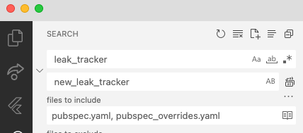

# Contributing to leak tracker.

For general contributing information, see Dart-wide [CONTRIBUTING.md](https://github.com/dart-lang/.github/blob/main/CONTRIBUTING.md).

##  Roll the latest version of `leak_tracker` to Flutter

To upgrade version of leak tracking packages used by Flutter and thus used by
all applications that depend on Flutter:

1. Publish new version of the packages by running `sh tool/lt_publish.sh`.

2. If the changes affect APIs used by Flutter,
   ask a googler to refresh the packages with copybara in G3.

3. Upgrade [Flutter](https://github.com/flutter/flutter):

    1. If `leak_tracker*` is pinned in
       [update_packages_pins.dart](https://github.com/flutter/flutter/blob/main/packages/flutter_tools/lib/src/update_packages_pins.dart),
       update the versions.
    2. In `packages/flutter` run `../../bin/flutter update-packages --force-upgrade`
  
       If upgrade for all packages causes complicated failure of bots, cherry pick upgrade for
       just leak tracker:
   
      ```
      ../../bin/flutter update-packages --cherry-pick-package leak_tracker --cherry-pick-version <version of leak_tracker> 
      ../../bin/flutter update-packages --cherry-pick-package leak_tracker_flutter_testing --cherry-pick-version <version of leak_tracker_flutter_testing>
      ```

## Regenerate DEPENDENCIES.md

To regenerate [diagrams](https://pub.dev/packages/layerlens), run in the root of packages:

```shell
sh tool/diagrams.sh
```

## Use different `leak_tracker`

When you reference `leak_tracker` from your application, version should be `any`, because
the version is pinned by Flutter.

If you want to use a different version of `leak_tracker` in your Flutter application,
you can reference a local renamed leak tracker package:

1. Clone it: `git clone git@github.com:dart-lang/leak_tracker.git`

2. Make global replacements:

   - In all '*.dart' files: replace 'package:leak_tracker' with 'package:new_leak_tracker'

   - In all files 'pubspec.yaml, pubspec_overrides.yaml': replace ' leak_tracker' with ' new_leak_tracker'

   

3. Follow steps in [DETECT](./DETECT.md) to enable leak tracking, referencing
   the local `new_leak_tracker*`, instead of what is instructed:

   ```
   new_leak_tracker...:
     path: <local path to leak tracker>
   ```
