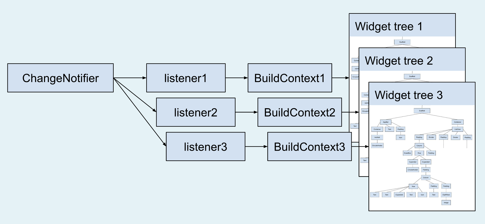

Coming soon! See https://github.com/flutter/devtools/issues/3951.

The text below is under construction.

# Motivation for leak tracking

This page describes motivation behind memory leak tracking.
Read more about leak tracking in [overview](OVERVIEW.md).

## Why do disposables exist?

In most cases object lifecycle is managed well by a garbage collector.

However, some objects (memory-risky objects) require special care, to avoid risk of memory leaks:
1. Objects that allocate significant memory for their members
2. Objects that may reference a significant number of other objects, designed to be short living (like the entire widget tree), and prevent them from being GCed in time.

Such objects have method `dispose`, which has two purposes:

1. Releases the resources, to make sure they do not stay longer than needed.
2. Explicitly marks the object as not needed, to make lifecycle management easier. For example:
    a. Some objects restrict invocation of some methods after disposal.
    b. It is expected that objects should be available for GC after disposal, so owners of the objects should null the references after invocation of `dispose`.

## Memory efficiency of applications

To ensure **memory efficiency** of applications, engineers should watch that:
1. All disposables are disposed when they are not needed any more.
2. Large objects and objects, which reference big sets of other objects, are not reachable after usage.
3. Objects allocate a reasonable amount of memory necessary to perform their tasks.

Engineers want their applications to be memory efficient, but they want to minimize time and mental effort spent worrying about the items above.

Leak tracker fully automates item #1, and almost fully automates item #2.
(‘Almost’ means with the assumption that, if a large chunk of objects is held from GC longer than needed, some of them are disposables and thus will be detected by the leak tracker. This assumption is not always true: in rare cases a large chunk of objects is held from being GCed, but there are no disposables.)

As a result, leak_tracker increases confidence and reduces effort related to memory efficiency.

Item #3 is not covered by leak_tracker. There are no known tools to automate it so far. All known methods are manual:
1. Analyzing the consumed memory Memory using DevTools snapshotting and diffing
2. [Memory baselining](../BASELINE.md) in regression tests

## How large can memory leaks be?

How large can a memory leak be when disposal is forgotten or when an object is referenced after disposal?

The cases below are selected from the GitHub issue history and illustrate three types of memory issues:

1. Out of memory crash
2. 100K+ leaks
3. Leaks with no numbers recorded, but significant enough to file, investigate and fix the issue

### Forgotten `dispose`

1. VideoController caused crash: https://github.com/flutter/flutter/issues/72643
2. Canvas size is growing infinitely: https://github.com/flutter/flutter/issues/58437
3. WebGL caused 2GB+ Leak: https://github.com/flutter/flutter/issues/52485

### Disposed, but notGCed

1. Disposed but not GCed Route is leaking: https://github.com/flutter/flutter/issues/88073.
(A route may reference the entire page widget tree.)

2. [Internal Google app](http://b/179704144) leaked at least 300K of notGCed objects at startup.
Some of them are disposed disposables, detectable by leak tracker.

### Fixed `dispose`

Issues here are fixed by updating ‘dispose’, not invoking it.
That means not invoked ‘dispose’ would cause a significant leak.

1. `Vertices` causes app crash: https://github.com/flutter/flutter/issues/54762
2. `VideoPlayerController` causes leak 25MB: https://github.com/flutter/flutter/issues/86477
3. `AnimationController` causes significant leak: https://github.com/flutter/flutter/issues/84730
4. `ImageShader` causes significant leak: https://github.com/flutter/flutter/issues/82832
5. Google map causes app crash: https://github.com/flutter/flutter/issues/35243
6. Images in `GridView` causes crash: https://github.com/flutter/flutter/issues/19558
7. `CanvasImage` causes significant leak: https://github.com/flutter/flutter/issues/57746
