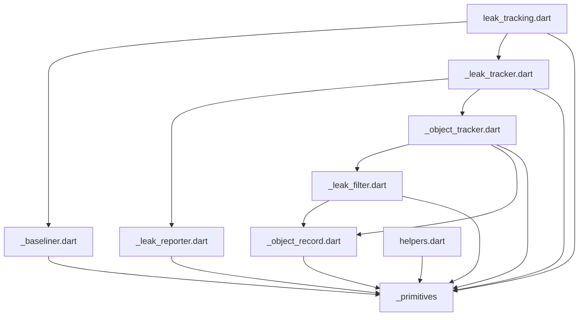

<!---
Generated by https://github.com/polina-c/layerlens
Dependencies that create loop are markes with `!`.
-->

```mermaid
flowchart TD;
_baseliner.dart-->_primitives;
_leak_filter.dart-->_object_record.dart;
_leak_filter.dart-->_primitives;
_leak_reporter.dart-->_primitives;
_leak_tracker.dart-->_leak_reporter.dart;
_leak_tracker.dart-->_object_tracker.dart;
_leak_tracker.dart-->_primitives;
_object_record.dart-->_primitives;
_object_tracker.dart-->_leak_filter.dart;
_object_tracker.dart-->_object_record.dart;
_object_tracker.dart-->_primitives;
helpers.dart-->_primitives;
leak_tracking.dart-->_baseliner.dart;
leak_tracking.dart-->_leak_tracker.dart;
leak_tracking.dart-->_primitives;
```

